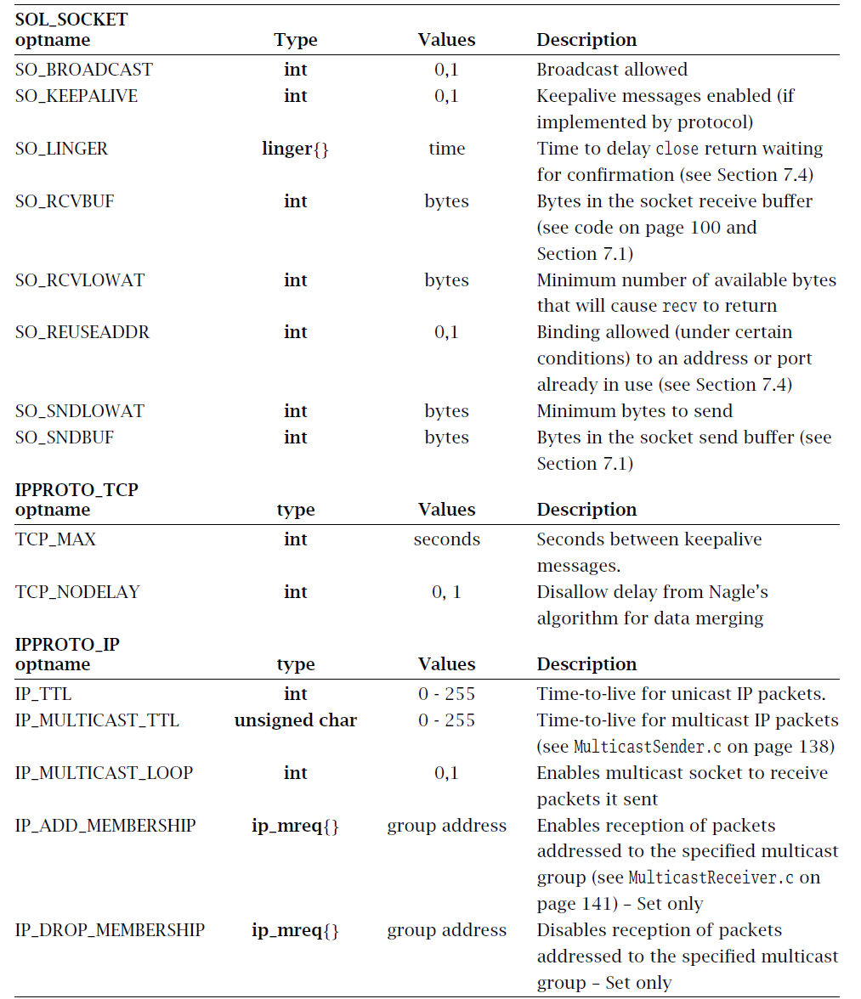
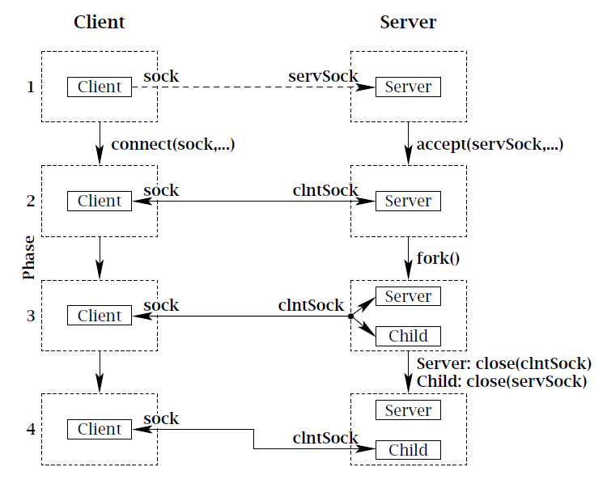
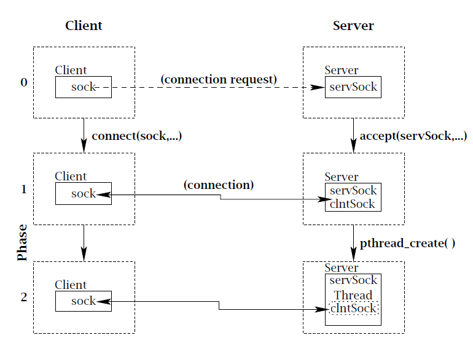
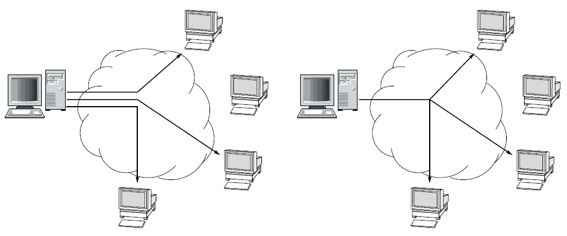

# Socket Options

```C
int getsockopt(int socket, int level, int optName, void *optVal, socklen_t *optLen);
int setsockopt(int socket, int level, int optName, const void *optVal, socklen_t optLen);
```

`getsockopt` : option's current value will **be placed**(the pointers above **get** the value of socket)

`setsockopt` : socket option in the implementation will be **set** to the value in the buffer.

Arguments :

- `socket` : socket descriptor
- `level` : level of option
- `optName` : specifying option
- `optVal` : pointer to a buffer
- `optLen` : length of a buffer

Return

- Fail : -1
- Success : 0

### Example

```C
int rcvBufferSize;
// Retrieve and print the default buffer size
int sockOptSize = sizeof(rcvBufferSize);
if (getsockopt(sock, SOL_SOCKET, SO_RCVBUF, &rcvBufferSize, &sockOptSize) < 0)
DieWithSystemMessage("getsockopt() failed");
printf("Initial Receive Buffer Size: %d\n", rcvBufferSize);
// Double the buffer size
rcvBufferSize *= 2;
if (setsockopt(sock, SOL_SOCKET, SO_RCVBUF, &rcvBufferSize, sizeof(rcvBufferSize)) < 0)
DieWithSystemMessage("setsockopt() failed");
```

### Socket option




# SIGNAL

- **Signals** provide a mechanism for notifying programs that certain events have occured. 
- Some of events are caused *asynchronously* because of some **signals**.
- **Signal** are delivered to executing program regardless of a program states.
- Programs that catch and handle signals need to be prepared for erroneous returns from system calls that can block.
- Server should always handle `SIGPIPE` so that they can detect the client's disappearance and reclaim any resources and reclaim any resources that were in use to service it.

### Most frequently used signals

| Type       | Triggering Event                    | Default     |
| ---------- | ----------------------------------- | ----------- |
| `SIGALRM`  | Expiration of an alarm timer        | termination |
| `SIGCHILD` | Child process exit                  | ignore      |
| `SIGINT`   | Interrupt char (Control-C) input    | termination |
| `SIGIO`    | Socket ready for I/O                | ignore      |
| `SIGPIPE`  | Attempt to write to a closed socket | termination |


## API

```c
int sigaction (int whichSignal, const struct sigaction *newAction, struct sigaction *oldAction)
```

Arguments

- `whichSignal` : Signals to set

- `newAction` : New action to be set
- `oldAction` : Old action that was previously set

Return

- Success : 0
- Fail : -1

```c
struct sigaction {
    void (*sa_handler)(int); // Signal handler
    sigset_t sa_mask; // Signals to be blocked during handler execution
    int sa_flags; // Flags to modify default behavior
};
```


```C
int sigemptyset(sigset_t *set)
int sigfillset(sigset_t *set)
int sigaddset(sigset_t *set, int whichSignal)
int sigdelset(sigset_t *set, int whichSignal)
```

- `sigemptyset` : unset all of the flags in the given `set`
- `sigfillset` : set all of the flags in the given `set`
- `sigaddset` : add given *whichSignal* to `set`
- `sigdelset` : delete given *whichSignal* to `set`

Returns :

- Success : 0
- Fail : -1


# Nonblocking I/O

- Default behavior of a socket call is to block until the requested action is completed, which works with OS.
  - `accept()` blocks until a connection has been established with client's `connect()`
  - `recv()` and `recvfrom()` block if data is not availiable.
  - `send()` on TCP socket may block if there is not sufficient space to buffer the transmitted data.
- If either the datagram sent from the client or the echoed datagram from the server is lost, out echo client blocks indefinitely.


## Nonblocking Sockets

- A solution to prevent a circumstance  that datagram is lost is to set all calls as **nonblocking**.
- If a requested operation fails, system sets `errorno` instead of indefinite waiting.
  - If `connect()` fails --> `errorno` is set to `EINPROGRESS`. (for TCP)
  - Otherwise, ... ---> `errorno` is set to `EWOULDBLOCK`

- There are no send buffers for UDP sockets, so `send()` and `sendto()` never return `EWOULDBLOCK`.
- For  **UDP**  `connect()`, the call is never block because of *UDP* features.
- For **TCP**   `connect()` , `errorno` is set to `EINPROGRESS` if the call fails, indicating that socket still tries to establish TCP connection.
- Not recommending to set socket *nonblock* until after `connect()` is finished.

```C
int fcntl(int fd, int cmd);
int fcntl(int socket, int command, long arg);
```

Set file property(In UNIX, socket is also considered as file)

- Arguments

  - `socket` : file descriptor for socket

  - `command` : specified operation which is always system defined constant

  - `arg` : arguments for operations

- Return

  - Success : 0

  - Fail : -1
  - ETC : fd

- `fcntl` commands

  - `F_GETFL` : Return(as the function result) the file access mode and the file status flags; `arg` is ignored

  - `F_SETFL ` : Set the file status flags to the value specified by `arg`, not important for socket
    - `args` : `O_APPEND`,  `O_ASYNC`,  `O_DIRECT`,  `O_NOATIME`,  `O_NONBLOCK`
  - `F_GETFD` : Return(as the function result) the file descriptor flags; `arg` is ignored.
  - `F_SETFD` : Set the file descriptor flags to the value specified by `arg`.
  - `F_SETOWN` : Set the process ID or process group ID that will receive `SIGIO` and `SIGURG` signals for events on the file descriptor fd. The target process or process group ID is specified in `arg`.
  - `F_GETOWN` : Return(as the function result) the process ID or process group ID currently receiving `SIGIO` and `SIGURG` signals for events on file descriptor fd. `arg` is ignored.


## Asynchronous I/O
- The difficulty with nonblocking socket calls is that there is no way of knowing when one would succeed, except by periodically trying it until it does(known as *polling*)
- A method that OS inform the program when a socket call is successful is called **Asynchronous I/O**, which transfers a callback function to handle a success event.
- `SIGIO` signal delivers th the process when I/O-related event occurs on the socket.
- Two steps to set **Nonblocking** and **Asynchronous I/O**
  - Register `SIGIO` with `sigaction()`
  - Set asynchronous I/O with `fcntl`


# Timeouts

- Some I/O events may not happen for a certain time period
- Client cannot tell directly whether a loss has occured, so it sets a limit on how long it will wait for a response.


```C
unsigned int alarm(unsigned int secs);
```

`alarm()` starts a timer, which expires after the specified number of seconds(`secs`), where it registers by a defined constant `SIGALRM`.

- Arguments

  - `sec` : Seconds for waiting

- Return

  Remaining seconds


# Multitasking

- To server multiple clients concurrently, we needs multitasking methods.
- A server which serves only one client at a time is called *iterative server*, which is improper to modern server implementation.
- To overcome a limitation of *iterative server*, multitasking techniques such as thread and process are adopted and the servers implemented by them are called *concurrent server*.

## Per-Client Processes

- For each client connection request, a new *process* to handle the communication is created.
- Processes share the resource of the server host, each servicing its client concurrently.
- In UNIX system, `fork()` creates  a new process and `waitpid()` terminates child process.
- When a listening server accepts request, they *forks* child that deals with a client request.



### API

```C
 pid_t fork(void);
```

Create a new child process copied from a parent process.

- Return
  - Parent Process : value > 0
  - Child Process : value = 0
  - Fail : -1

```C
pid_t waitpid(pid_t pid, int *status, int options);
```

Wait for child(s) process(es) and get information from it(them)

- Arguments
  - pid 
    - < -1 : meaning wait for any child process whose process group ID is equal to the absolute value of *pid*.
    - -1 : meaning wait for any child process..
    - 0 : meaning wait for any child process whose process group ID is equal to that of the calling process
    - \> 0 : meaning wait for the child whose process ID is equal to the value of *pid*.
  - options :
    - **WNOHANG** : return immediately if no child has exited.
    - **WCONTINUED** : also return if a stopped child has been resumed by delivery of **SIGCONT**.
    -  **WUNTRACED** : return pended child process
- Return
  - \> 0 :  success, terminated process id
  - -1 : Fail


## Per-Client Thread

- *Per-Client Processes*  is expensive, since it generates a new process.
- *Threads* decrease this cost by allowing multitasking within the same process.
- If a child process goes awry, it is easy to monitor and kill it rom the command line using its process identifile. Threads may not provide this capability on some platfroms, so additional server functionality must be provided to monitor and kill individual treads.
- If the operating system is oblivious to the notion of threads, it may gives every process the same size time slice. In that case a threaded Web server handling hundreds of clients may get the same amount of CPU time as game of solitaire.



## Constrained Multitasking

- Process and thread creation both incur overhead -- Scheduling and context switching among many processes or threads creates extra work for system.
- Limiting the number of processes created by the server, which is called *constrained-multitasking server* can solve the overhead problem -- It does not use `wait` function.


## Multiplexing

- Sometimes, an application needs the ability to do I/O on multiple channels.
- Which socket to choose is an issue of multiplexing. --> *Blocking  socket* can cause issue
- *Nonblocking socket* can solve this issue, however, a system should poll the sockets, which results in time waste.
- UNIX providing function `select()` can solve these issues.

#### API

```C
int select(int maxDescPlus1, fd_set *readDescs, fd_set *writeDescs, fd_set *exceptionDescs,
		struct timeval *timeout)
```

`select` monitors lists of descriptors. If passing `NULL`, the fd set will be igonored.

- Arguments

  - `maxDescPlus1` : Number of descriptors to monitor : Max descriptor + 1
  - `readDescs` Descriptors in this list are checked for immediate input data availability; that is, a call to `recv()` (or `recvfrom()` for a datagram socket) would not block
  - `writeDescs` : Descriptors in this list are checked for the ability to immediately write data; that is, a call `send()` (or `sendto()` for a datagram socket) would not block.
  - `exceptionDescs` : Descriptor in this list are checked for pending exception for a TCP socket would be if the remote end of a TCP socket had closed while data were still in the channel; in such a case, the next read or write operation would fail and return `ECONNRESET`.
  - `timeout` : Allowing control over how long `select()` will wait for something to happen. If `timeout` is `NULL`, `select()` infinitely waits for some events.

- Return

  - Success : Total number of descriptors prepared for I/O is returned. To indicate the descriptors ready for I/O, `select()` changes the descriptor lists so that only the positions corresponding to ready descriptors are set.

    (ex) 0, 3, 5 of read descriptor ready ---> `readDescs` = 100101

  - Fail : -1

  - No event : 0


```C
void FD_ZERO(fd_set *descriptorVector);
void FD_CLR(int descriptor, fd_set *descriptorVector);
void FD_SET(int descriptor, fd_set *descriptorVector);
int FD_ISSET(int descriptor, fd_set *descriptorVector);
```

API for adjusting fd\_set

- `FD_ZERO)_` empties the list of descriptors
- `FD_CLR()` removes descriptors to the list
- `FD_SET` adds descriptors to the lsit
- `FD_ISSET` : Return nonzero if given descriptor is in the list or zero if it is not. 


```C
struct timeval {
    time_t tv_sec; // Seconds
    time_t tv_usec; // Microseconds
};
```

Structure for time. Setting both `tv_sec` and `tv_usec` to 0 causes `select()` to return immediately, enabling polling of I/O descriptors.


# Multiple Recipients

- Sometimes we would like to send the same information to more than one recipient, not single recipient.
- Sending to multiple recipients have two kinds of service, which are called *broadcast* and *multicast*.
- *Broadcast* and  *Multicast*
  - With *broadcast*, the program calls `sendto()` once, and the message is automatically delivered to *all* hosts on the local network, not a certain group.
  - With *multicast*, the message is sent once and delivered to a specific(possibly empty) *group* of hosts throughout the Internet - namely, those that have indicated to the network that they should receive messages sent to that group.
  - UDP sockets can use broadcast and multicast services
  - Broadcast only covers a local scope, typically a local area network.
  - Multicast across the entire Internet is presently not supported by most Internet service providers.

​																				<Unicast and Multicast>



​											

## Broadcast

- UDP datagram can be sent to all nodes on an attached local network by sending them to a special address, 255.255.255.255, which is called the "limited broadcast address" in IPv4.
- Routers do not forward packets addressed to limited broadcast address.
- Packets addressed to limited broadcast address are delivered to all of the hosts in local network.
- To send broadcasting packets, `SO_BROADCAST` must be set by `setsockopt()`

